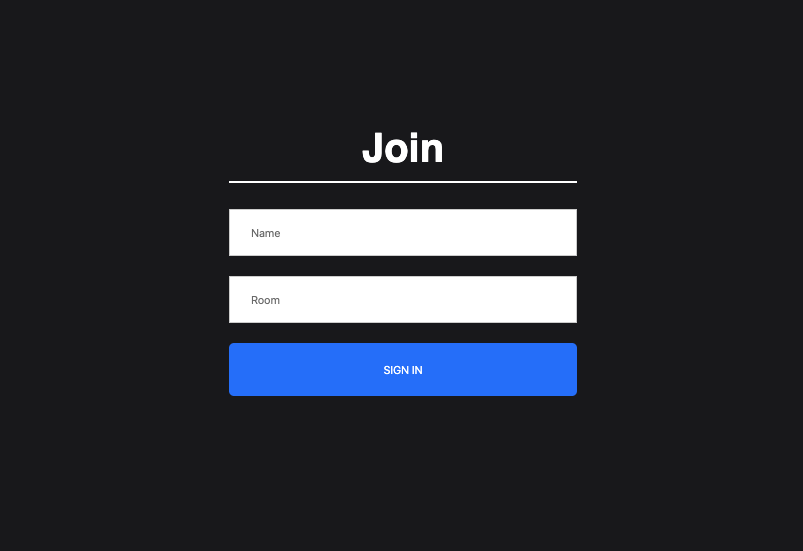
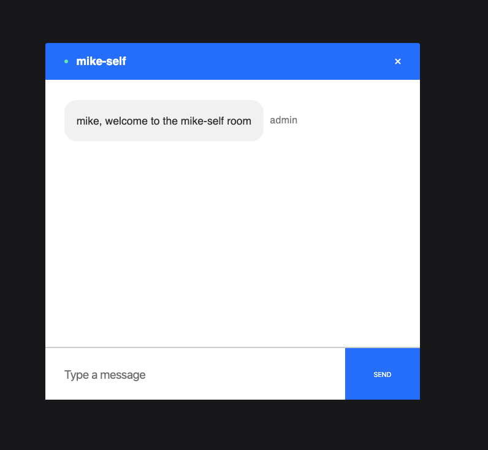

# Private Chat App

## Problem

> This web-app was created for private chats - group or 2 way 
> conversations. A user can create a room name by
> entering name and simply adding a group name.
> Anybody with this room name can join the room from anywhere in the world.

#### Technology Used

> React, JavaScript, CSS, NPM, Socket.io
> [Check out Private Chat App](https://https://private-chat-michael-anokye.netlify.app/ "Link to Private Chat App").

## Landing Screen

> Private Chat Appwelcomes you with a landing screen where a 
> user can join a room with just a name and a room name.

> 

## Chat Screen

> Users with the same room name can chat privately.
> Users are alerted when a new user joins the room and 
> when they leave the room. 
> on the status compared to the calorie goal.
> 

## Video Demo

> Below is a video demo of how Private Chat App works.
> 
